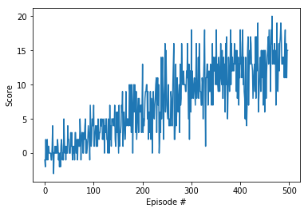

# Deep RL Nanodegree - Report for Project 1
In this project, an agent is trained to navigate (and collect bananas!) in a large, square world. 

## Learning Algorithm
In order to solve this problem, [DQN](https://storage.googleapis.com/deepmind-media/dqn/DQNNaturePaper.pdf) is used. DQN is a [Q-learning](https://en.wikipedia.org/wiki/Q-learning) algorithm that uses deep learning to estimate the Q-function. 
In contrast to previous methods it has two key features making it work so well: 
- Experience Replay
- Fixed Q-Targets

## Training Details
The following hyper-parameters were used. 

```python
BUFFER_SIZE = int(1e5)  # replay buffer size
BATCH_SIZE = 64         # minibatch size
GAMMA = 0.99            # discount factor
TAU = 1e-3              # for soft update of target parameters
LR = 5e-4               # learning rate 
UPDATE_EVERY = 4        # how often to update the network
```

## Plot of Rewards


The environment was solved in 398 episodes!	Average Score: 13.04

## Future Work

### Improved version of DQN

Implement a double DQN, a dueling DQN, and/or prioritized experience replay!

### Learning from Pixels

In the project, the agent learned from information such as its velocity, along with ray-based perception of objects around its forward direction.  A more challenging task would be to learn directly from pixels!

To solve this harder task, you'll need to download a new Unity environment.  This environment is almost identical to the project environment, where the only difference is that the state is an 84 x 84 RGB image, corresponding to the agent's first-person view. 

You need only select the environment that matches your operating system:
- Linux: [click here](https://s3-us-west-1.amazonaws.com/udacity-drlnd/P1/Banana/VisualBanana_Linux.zip)
- Mac OSX: [click here](https://s3-us-west-1.amazonaws.com/udacity-drlnd/P1/Banana/VisualBanana.app.zip)
- Windows (32-bit): [click here](https://s3-us-west-1.amazonaws.com/udacity-drlnd/P1/Banana/VisualBanana_Windows_x86.zip)
- Windows (64-bit): [click here](https://s3-us-west-1.amazonaws.com/udacity-drlnd/P1/Banana/VisualBanana_Windows_x86_64.zip)

Then, place the file in the `p1_navigation/` folder in the DRLND GitHub repository, and unzip (or decompress) the file.  Next, open `Navigation_Pixels.ipynb` and follow the instructions to learn how to use the Python API to control the agent.

(_For AWS_) If you'd like to train the agent on AWS, you must follow the instructions to [set up X Server](https://github.com/Unity-Technologies/ml-agents/blob/master/docs/Training-on-Amazon-Web-Service.md), and then download the environment for the **Linux** operating system above.